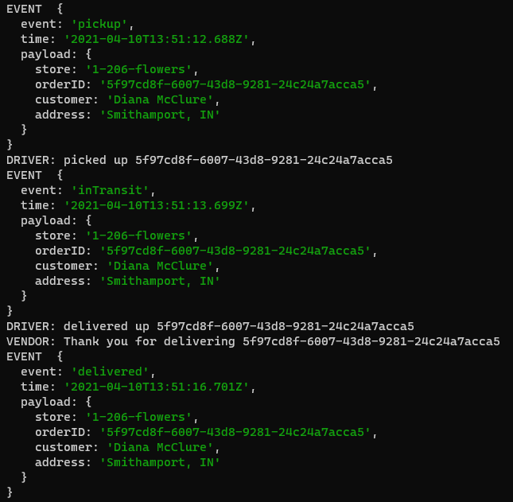
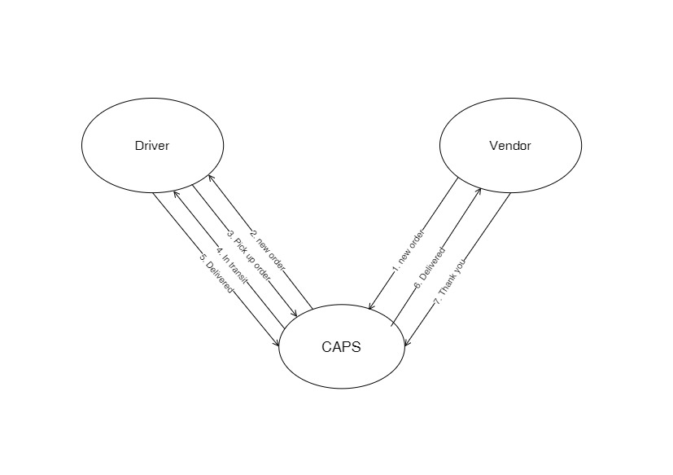

# LAB: Event Driven Applications

CAPS Phase 1: Begin the build of an application for a company called CAPS - The Code Academy Parcel Service. In this sprint, we’ll build out a system that emulates a real world supply chain. CAPS will simulate a delivery service where vendors (such a flower shops) will ship products using our delivery service and when our drivers deliver them, be notified that their customers received what they purchased.

Tactically, this will be an event driven application that “distributes” the responsibility for logging to separate modules, using only events to trigger logging based on activity.

**Author:** Afnan Damra
**Version:** 1.0.0

**Links:**

- [Repo Link](https://github.com/afnandamra/caps)
- [GitHub Actions](https://github.com/afnandamra/caps/actions)
- [PR Link](https://github.com/afnandamra/caps/pull/1)

## Setup

### Install

- Clone the repository from GitHub
- Run the command `npm i dotenv faker jest` to install dependencies
- create .env file with STORE variable with the store name

### Test

- Run the command `npm test` to test and verify the events are being called.
- Run the command `npm run lint` for testing lint.

### Run

- Run the command `nodemon` or `npm start` to see the events in action (example below).

## Documentation

### UML Diagram

Below is a UML of my application (created at https://app.diagrams.net)

## Resources

CAPS system overview from [Codefellows](https://codefellows.github.io/code-401-javascript-guide/curriculum/apps-and-libraries/caps/)
